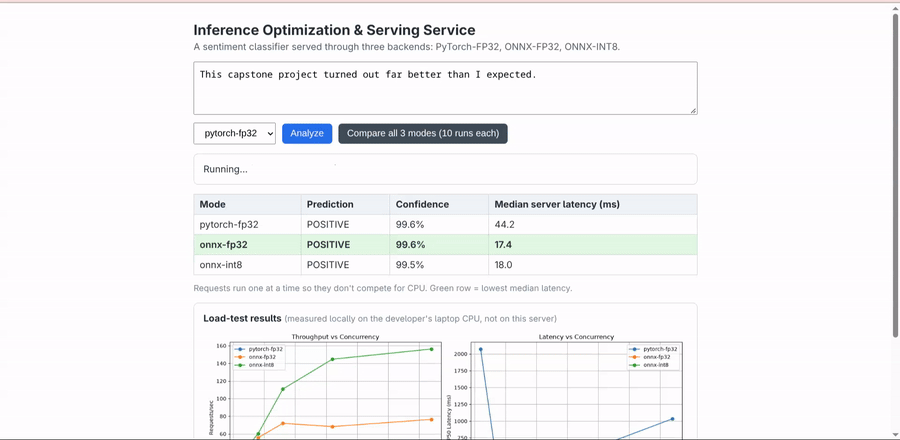
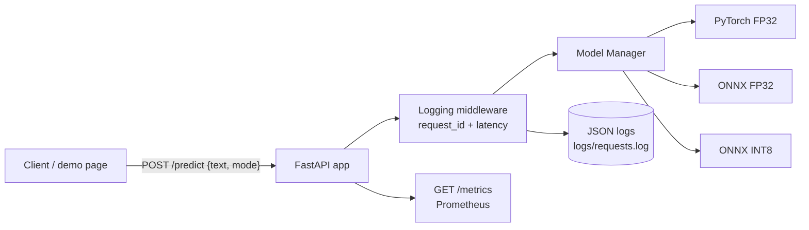
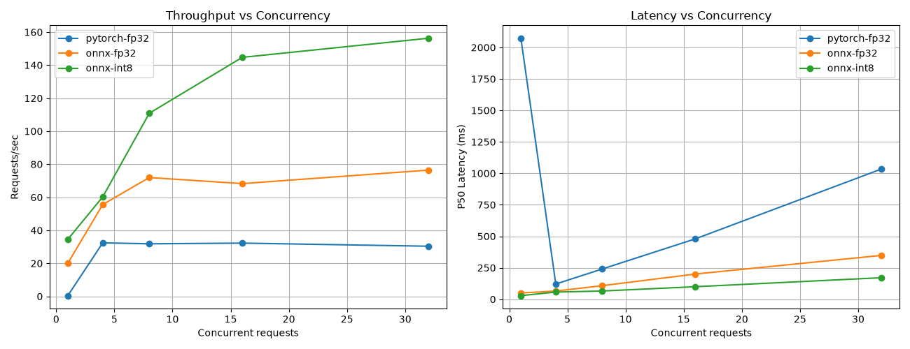

# Inference Optimization & Serving Service

A sentiment-classification API served through three interchangeable backends —
**PyTorch-FP32**, **ONNX-FP32**, and **ONNX-INT8** — selectable per request, with
request tracing, Prometheus metrics, a load-testing tool, and one-command Docker deployment.

**[Live demo](https://YOUR_HF_USERNAME-inference-serving-capstone.hf.space)** ·
Built as the capstone of an 8-week AI-inference learning roadmap.



## Why this exists
Before putting a model in production, an inference team has to answer: *how much faster
and smaller can we make it, what does it cost in accuracy, and how does it behave under
concurrent load?* This project answers that for one model end to end — export, quantize,
serve, measure — with every backend reachable through the same API so the comparison is
apples-to-apples.

## What it does
- Serves `distilbert-base-uncased-finetuned-sst-2-english` through 3 backends, chosen per request with `mode`
- Loads every backend **once at startup**, never per request
- Validates input with Pydantic (including an enum for `mode`) and returns structured errors
- Writes structured JSON logs with a per-request ID, and exposes Prometheus metrics at `/metrics`
- Ships an async load tester that sweeps concurrency levels and generates a comparison chart
- Includes a live demo page that benchmarks all three modes side by side in the browser

## Architecture

Every backend implements the same `predict(text) -> (label, confidence)` interface, so adding a
new one means writing one class and registering it. ONNX files are exported and quantized
at Docker **build** time (`scripts/export_models.py`), so the container starts with nothing left to compute.

## Quick start
**Docker**
```bash
docker build -t inference-capstone .
docker run --rm -p 7860:7860 inference-capstone
# open http://localhost:7860
```
**Local development**
```bash
uv sync
uv run scripts/export_models.py          # one-time: creates models/*.onnx
uv run uvicorn app.main:app --port 8000
```

## API
| Endpoint | Description |
|---|---|
| `GET /` | Interactive demo page |
| `POST /predict` | `{"text": "...", "mode": "pytorch-fp32 \| onnx-fp32 \| onnx-int8"}` → label, confidence, latency_ms |
| `GET /health` | Readiness + list of loaded backends |
| `GET /metrics` | Prometheus metrics (request counts, latency histograms per mode) |
| `GET /docs` | Auto-generated OpenAPI docs |

## Results
Measured on an HP Victus laptop (CPU: `___`), CPU inference only. Each cell is one burst of N
simultaneous requests via `scripts/load_test.py`. Raw data: `docs/load_test_results.json`.

[paste output of scripts/results_table.py here]



**Findings**
- Fastest backend at every concurrency level: `___`
- INT8 vs PyTorch-FP32 at concurrency 1: `___%` lower P50 latency
- Throughput plateaus around concurrency `___`
- All three modes returned the same label on every test input: `___`

## Design decisions
- **Load once, serve many.** Models load in FastAPI's lifespan hook, never inside the request handler.
- **Sync endpoint on purpose.** ONNX Runtime's `run()` blocks; a plain `def` lets FastAPI run it in a threadpool instead of freezing the event loop.
- **Export at build time.** The image is self-contained and cold starts don't redo export/quantization.
- **CPU-only PyTorch in the image.** Avoids gigabytes of unused CUDA libraries.
- **No vLLM.** This is a classifier, not LLM generation; continuous batching and PagedAttention don't apply.
- **Measurement hygiene.** Warm-up runs excluded, percentiles instead of means, sequential comparison in the demo page.

## Limitations
- **Requests are not batched together.** Each concurrent request runs its own forward pass, unlike
  vLLM/Triton-style batching. The concurrency curves here show how a *non-batched* service scales.
- Benchmarks were measured on a laptop CPU; the free hosted demo has different hardware (2 vCPU), so absolute numbers differ.
- PyTorch is still bundled for the baseline backend, which keeps the image larger than an ONNX-only build would be.
- Single-stage Docker build; export-time dependencies (`onnx`, `onnxscript`) remain in the final image.
- One model, one task (English sentiment).

## What I'd improve next
- Micro-batching queue to group concurrent requests into one forward pass
- Multi-stage Docker build and an ONNX-only slim image
- GPU backend (TensorRT / ONNX Runtime CUDA provider) as a fourth mode
- Accuracy evaluation on a labeled set (SST-2 validation) per backend, not just label agreement
- CI that builds the image and runs the API smoke tests

## Project structure
```
app/            FastAPI app, model manager, schemas, demo page
scripts/        export_models.py, load_test.py, analyze_logs.py, results_table.py
docs/           benchmark chart, raw results, demo GIF
Dockerfile      CPU-only, non-root, build-time export
```

