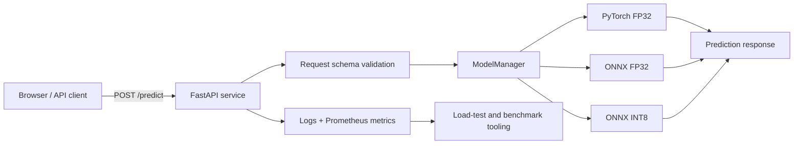
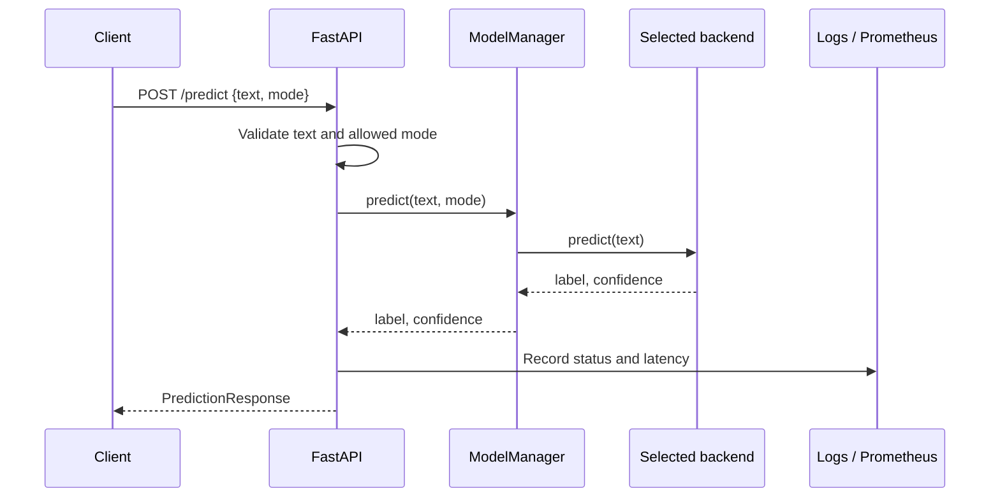
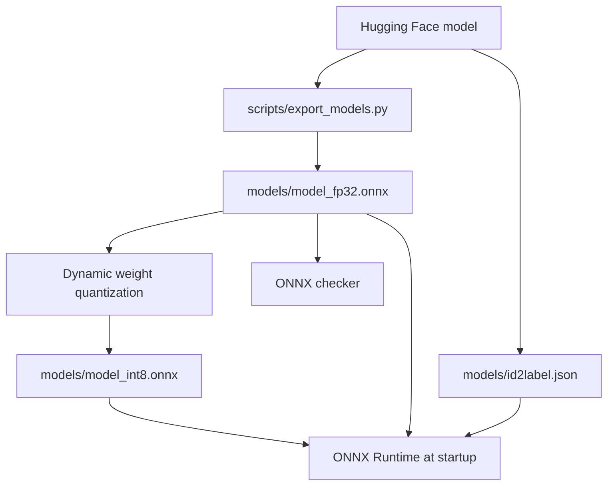
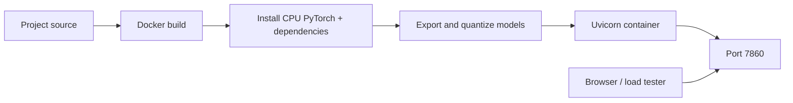

# Inference Optimization & Serving Service

> A CPU-first sentiment-classification service that makes model optimization measurable.
>
> **One API · three interchangeable inference backends · structured observability · reproducible benchmarks**

## 1. Executive overview

This project serves the same DistilBERT sentiment model through three execution
paths:

| Backend | Runtime | Precision | Purpose |
| --- | --- | --- | --- |
| `pytorch-fp32` | PyTorch + Transformers | FP32 | Baseline correctness and performance reference |
| `onnx-fp32` | ONNX Runtime | FP32 | Graph-optimized CPU inference |
| `onnx-int8` | ONNX Runtime | Dynamic INT8 weights | Memory and latency optimization |

The client chooses a backend per request with the `mode` field. Every backend
implements the same small contract, so the HTTP layer remains independent of
model-runtime details.



## 2. Current system boundary

### Inside the service

- FastAPI application and HTTP routing
- Input validation with Pydantic
- Model loading during application startup
- PyTorch and ONNX Runtime inference backends
- Request IDs, JSON request logs, latency metrics, and error handling
- Lightweight browser UI served from `/`
- Prometheus-compatible metrics at `/metrics`

### Outside the service

- Model export and quantization (`scripts/export_models.py`)
- Concurrent load testing (`scripts/load_test.py`)
- Log analysis (`scripts/analyze_logs.py`)
- Result tables and benchmark artifacts under `docs/` and `dashboard/`

The service is intentionally a classification API rather than a text-generation
server. vLLM is therefore out of scope for the core implementation.

## 3. Request lifecycle



The request is synchronous from the caller's perspective. Tokenization happens
inside the selected backend, and inputs are truncated to 128 tokens. Models are
loaded once during the FastAPI lifespan and reused for subsequent requests.

## 4. Component architecture

### `app/main.py` — service boundary

Owns the application lifecycle, middleware, routes, metrics, and static UI:

- `GET /` serves `app/static/index.html`.
- `POST /predict` validates the request, dispatches to `ModelManager`, and
  returns the normalized prediction response.
- `GET /health` reports readiness and the loaded backend names.
- `GET /metrics` exposes Prometheus text-format metrics.
- HTTP middleware attaches an `X-Request-ID`, measures request duration, and
  writes structured completion logs.

### `app/schemas.py` — API contract

`PredictRequest` restricts `mode` to the supported backend names and enforces a
non-empty text payload of at most 2,000 characters. `PredictResponse` provides a
stable response shape regardless of which runtime executed the request.

### `app/models.py` — inference abstraction

`ModelManager` owns the backend registry and performs mode-based dispatch. The
backends intentionally share this interface:

```text
predict(text: str) -> (label: str, confidence: float)
```

This keeps backend-specific concerns isolated:

- `PyTorchBackend` uses Transformers tokenization and a PyTorch model in
  evaluation mode with gradients disabled.
- `ONNXBackend` uses the shared tokenizer, feeds NumPy tensors into an
  `onnxruntime.InferenceSession`, and converts logits to probabilities with a
  numerically stable softmax.
- `onnx-fp32` and `onnx-int8` share implementation but load different model
  artifacts.

## 5. Model artifact pipeline



The export script is a one-time build/setup operation. It:

1. Downloads the tokenizer and pretrained classifier.
2. Exports a dynamically shaped FP32 ONNX graph.
3. Validates the graph with `onnx.checker`.
4. Produces the dynamically quantized INT8 artifact.
5. Stores the label mapping alongside both artifacts.

The Docker image runs this pipeline at build time, making container startup
self-contained and avoiding model conversion on every launch.

## 6. Observability

### Structured logs

`logs/requests.log` uses rotating JSON records. Request completion records
include timestamp, request ID, HTTP method and path, status code, latency in
milliseconds, and selected inference mode.

The console handler emits a human-readable equivalent for local development.
`scripts/analyze_logs.py` parses the JSON log and calculates mean, P50, and P99
latency by backend.

### Prometheus metrics

The service publishes:

- `capstone_requests_total{mode,status}` — successful and failed requests
- `capstone_request_latency_ms{mode}` — successful prediction latency

These metrics are intentionally low-cardinality: backend mode and outcome are
the only labels.

## 7. Benchmarking and UI

The browser UI in `app/static/index.html` provides two workflows:

1. **Analyze** — sends one request using the selected backend and displays the
   prediction, confidence, server latency, and browser round-trip time.
2. **Compare all 3 modes** — performs one warm-up and ten sequential timed
   requests per backend, then displays median server latency.

The standalone load tester exercises configurable concurrency levels across all
three modes and writes JSON results plus a chart. These results are benchmark
artifacts, not live service telemetry, and should be interpreted with the test
machine's CPU and workload in mind.

## 8. Deployment architecture



The production image is CPU-oriented and runs as a non-root user. During the
image build it installs the CPU PyTorch wheel, installs the application
dependencies, copies the service and export script, and creates the ONNX
artifacts. The runtime command is:

```bash
uvicorn app.main:app --host 0.0.0.0 --port 7860
```

For local development, the same application can be run on port `8000`:

```bash
uv run uvicorn app.main:app --reload --port 8000
```

## 9. Reliability and design decisions

### Startup readiness over partial availability

All three backends are loaded in the application lifespan. If a required model
artifact is missing or cannot be initialized, startup fails rather than
advertising a partially functional service.

### Stable dispatch contract

The API never needs to know whether a backend is PyTorch or ONNX. Adding a new
backend requires implementing the shared prediction contract and registering it
with `ModelManager`.

### No per-request model loading

Model initialization is expensive and would make latency measurements
meaningless. Loading once at startup keeps request latency focused on
tokenization and inference.

### Explicit CPU scope

The project measures CPU serving trade-offs between a baseline, graph
optimization, and quantization. GPU scheduling and generative inference are
outside the core scope.

## 10. Repository map

```text
app/
├── main.py              # FastAPI app, routes, middleware, metrics
├── models.py            # PyTorch and ONNX backend implementations
├── schemas.py           # Request and response models
└── static/
    ├── index.html       # Browser interface
    └── load_test_chart.png

models/                  # Generated model artifacts
scripts/
├── export_models.py     # Export + INT8 quantization
├── load_test.py         # Async benchmark runner
├── analyze_logs.py      # Log-derived latency statistics
└── results_table.py     # Markdown benchmark tables

dashboard/               # Local benchmark output
docs/                    # Captured demo and benchmark artifacts
Dockerfile               # Reproducible CPU container build
```

## 11. API surface

| Method | Path | Purpose |
| --- | --- | --- |
| `GET` | `/` | Serve the browser UI |
| `POST` | `/predict` | Run sentiment inference |
| `GET` | `/health` | Report loaded backends and readiness |
| `GET` | `/metrics` | Expose Prometheus metrics |
| `GET` | `/docs` | FastAPI-generated OpenAPI UI |

Example request:

```bash
curl -X POST http://localhost:8000/predict \
  -H 'Content-Type: application/json' \
  -d '{"text":"This service is fast and reliable.","mode":"onnx-int8"}'
```

Example response:

```json
{
  "label": "POSITIVE",
  "confidence": 0.998,
  "latency_ms": 4.2,
  "mode": "onnx-int8"
}
```

## 12. Roadmap

- Keep benchmark artifacts reproducible across local and container runs.
- Add automated API and backend consistency tests.
- Add a CI check for model artifact presence and startup readiness.
- Add a dedicated dashboard endpoint only if live, server-side aggregation is
  required; benchmark files and the current static UI remain intentionally
  separate.

## 13. Definition of done

- All three modes return consistent labels for the same input.
- Startup reports all expected backends as ready.
- Load tests produce success rate, throughput, P50, and P99 comparisons.
- Logs and metrics make backend-specific latency inspectable.
- The service builds and runs from a single Docker image.
- A new contributor can start the service and understand the architecture from
  this document without reverse-engineering the code.
